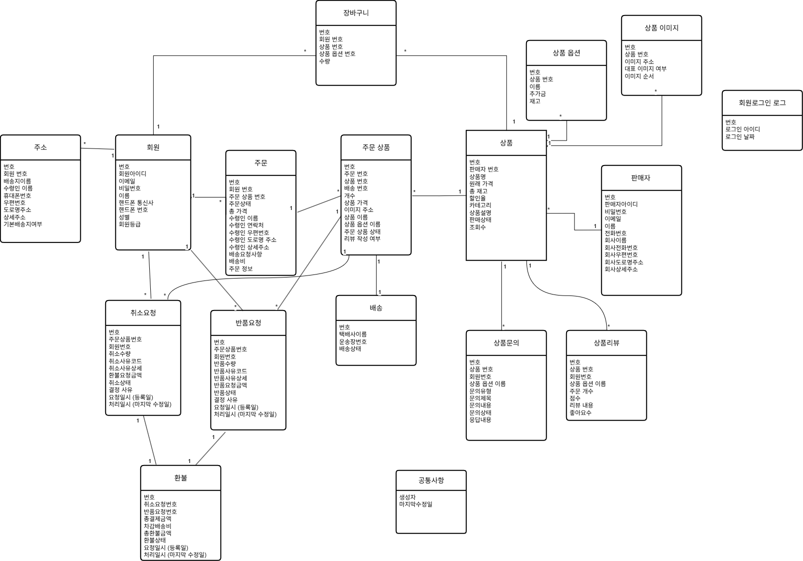
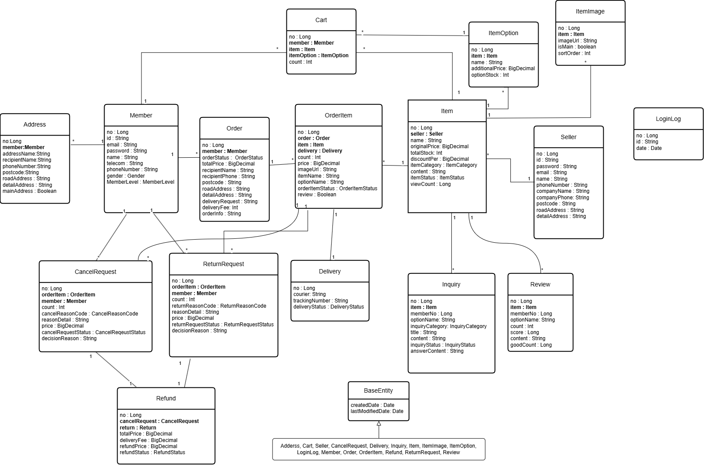
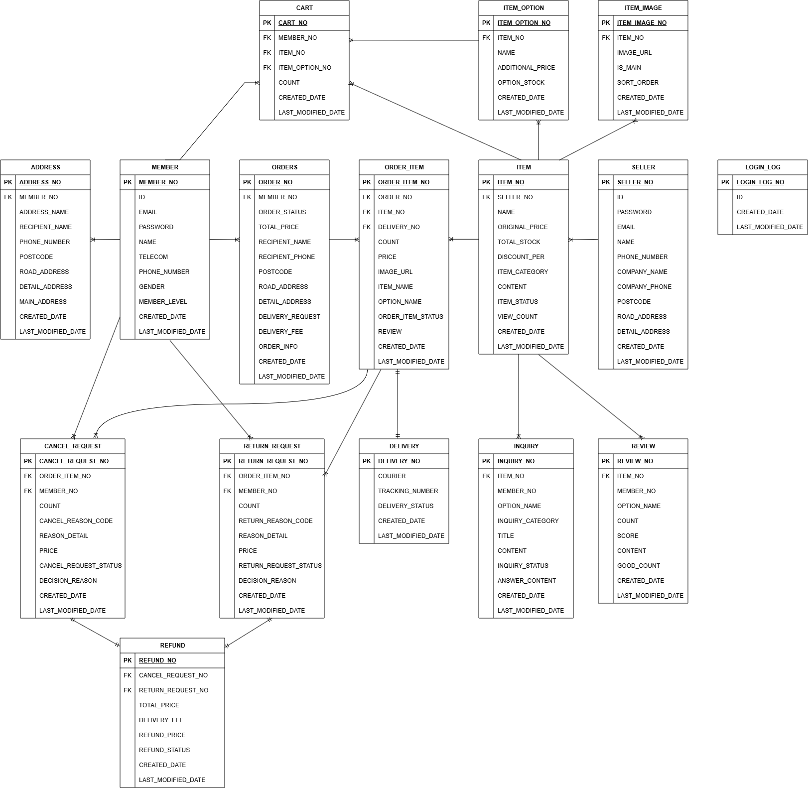

# myshop_dev 

Spring Boot 기반의 쇼핑몰 플랫폼입니다. 회원과 판매자를 위한 별도의 화면을 갖추고 있습니다.<br>
상품 등록부터 장바구니, 주문, 결제 전 재고 선점, 배송, 취소/반품/환불, 리뷰, 문의까지의 기능을 구현했습니다.

## 기술 스택

| 구분 | 내용                                             |
| --- |------------------------------------------------|
| Language | Java 17                                        |
| Framework | Spring Boot 4.0.5 (Gradle)                     |
| 인증/보안 | Spring Security(비밀번호 저장), JWT(회원 로그인 인증)       |
| 데이터 접근 | Spring Data JPA, QueryDSL, JPQL                |
| DB | H2                                             |
| 캐시/세션 저장소 | Redis (재고 선점 및 Refresh Token 저장)               |
| 뷰 | Thymeleaf                                      |
| 외부 연동 | Solapi(문자 인증), Spring Mail(Gmail SMTP, 이메일 인증) |
| 테스트 | JUnit 5, Spring Boot Test                      |


## ERD
### 논리 모델 (Logical)


### 물리 모델 (Physical)


### 데이터베이스 (Database)



## 패키지 구조

```
myshop.shop
├─ config           # SecurityConfig, MyShopConfig(QueryDSL 등)
├─ controller
│  ├─ memberWeb     # 회원용 컨트롤러 (로그인/주문/장바구니/문의/리뷰 등)
│  ├─ sellerWeb     # 판매자용 컨트롤러 (상품/배송/요청/문의 관리)
│  └─ Web           # 공통 컨트롤러 (예외처리, 홈화면, 상품 상세화면)
├─ dto              # 기능별 요청/응답 DTO
├─ entity           # 도메인별 JPA 엔티티
├─ filter           # JwtFilter, LogbackFilter
├─ interceptor      # 회원 로그인 체크(JWT), 판매자 로그인 체크(session)
├─ repository       # 도메인별 Repository + QueryDSL + 스프링 데이터 JPA
└─ service          # 도메인별 비즈니스 로직
```

 QueryDSL을 쓰는 리포지토리는 `XxxRepositoryCustom` 인터페이스와 `XxxRepositoryImpl` 구현체로 나뉘는 패턴을 따르고 있습니다.

## 주요 기능

### 1. 회원 / 판매자 인증
- 회원가입, 로그인, 비밀번호 재설정, 이메일/문자 인증(Solapi, Spring Mail)
- JWT 기반 로그인 유지: Access Token은 `Authorization` 헤더, Refresh Token은 HttpOnly 쿠키로 전달하는 혼합 방식
- Refresh Token은 Redis에 저장하여 서버 측에서 검증·무효화 가능
- 회원/판매자용 로그인 체크 인터셉터로 접근 제어

### 2. 상품 관리
- 상품/옵션 등록·수정·삭제, 이미지 다중 업로드
- QueryDSL 기반 상품 목록/검색/페이징, 판매자 상품 일괄 수정
- 조회수 증가 로직

### 3. 재고 동시성 제어
선차감, TTL 예약 전략을 사용하여 미결제 시 이벤트 기반 자동 롤백 구조를 사용합니다.

1. **낙관적 락(Optimistic Lock)**: `Item`, `ItemOption` 엔티티에 `@Version` 필드를 두어 동시 재고 차감 시 충돌을 감지합니다. 충돌 발생 시 `ExceptionController`에서 이를 잡아 사용자에게 재시도를 안내합니다.
2. **Redis 기반 재고 선점 + TTL 만료 이벤트를 이용한 자동 롤백**:
   - 장바구니 주문 또는 바로구매 시점에 실제 재고를 즉시 차감하고, 동시에 Redis에 예약 정보를 TTL(20초)과 함께 저장합니다.
   - Redis Keyspace Notification을 구독하여, 결제 시간 내 결제가 완료되지 않아 예약 키가 만료되면 차감했던 재고를 되돌립니다.
   - 즉, "선차감 → TTL 예약 → 미결제 시 이벤트 기반 자동 롤백" 구조로, 결제 대기 중 다른 사용자가 이미 선점된 재고를 중복 구매하지 못하게 막습니다.

> 참고: 예외 처리 계층(`ExceptionController`)에서 낙관적 락 실패(409), 비관적 락 실패(503), 락/쿼리 타임아웃(503) 등을 세분화해서 처리하고 있어, 동시성 이슈에 대한 장애 대응이 구조적으로 준비되어 있습니다.

### 4. 결제 전 흐름
- 장바구니 기반 주문과 즉시(바로)구매 두 가지 주문 경로 지원

### 5. 취소 / 반품 / 교환 / 환불
- `CancelRequest`, `ReturnRequest`, `ExchangeRequest`, `Refund` 엔티티로 사후 처리 기능을 모델링
- 판매자용 요청 관리 화면에서 승인/거절 처리

### 6. 배송 관리
- 판매자가 주문 배송 상태를 개별/일괄로 갱신

### 7. 리뷰 / 문의
- 구매 확정 상품에 대한 리뷰 작성 및 평점 집계
- 회원 문의 등록/조회, 판매자 문의 관리(카테고리·상태 필터링)


## 환경 설정 (`application.yml`)
로컬 실행 시 아래 환경 변수(또는 `.env` 파일)가 필요합니다.

- `GOOGLE_MAIL_ADDRESS`, `GOOGLE_MAIL_PASSWORD` — 이메일 인증 Gmail SMTP 계정
- `SOLAPI_API_KEY`, `SOLAPI_API_SECRET`, `SOLAPI_SENDER` — 문자 인증
- `FILE_STORE_PATH`, `FILE_EXTERNAL_STORE_PATH` — 파일 저장 경로
- `JWT_SECRET` — JWT 서명 키
- `REDIS_PASSWORD` — Redis 비밀번호

또한 로컬에 H2(TCP 모드)와 Redis가 구동 중이어야 합니다.<br>
TTL을 위해 redis.conf에서 notify-keyspace-events "Ex"를 사용해야 합니다.
## 실행 방법

```bash
# H2(TCP 모드)서버 및 Redis(윈도우 WSL)가 로컬에서 실행 중이어야 합니다. 
./gradlew bootRun
```
